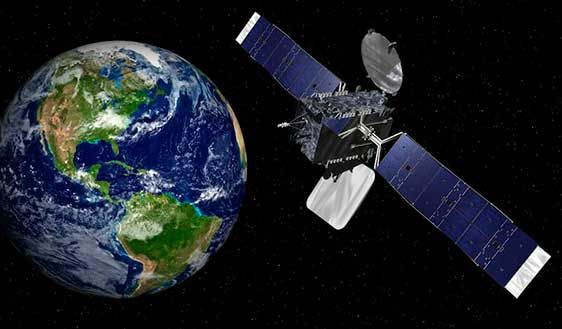

**EarthScope Vision** is a high-resolution visual analytics framework for planetary-scale monitoring of Earth’s surface conditions using satellite and aerial data. The system leverages open remote sensing datasets, advanced image segmentation methods, and interpretable detection models to observe and detect dynamic earth surface events and environmental risks with precision and speed.

---

## Project Scope

EarthScope Vision is built to detect and map complex terrestrial and environmental conditions using multi-spectral satellite imagery. The system is designed to generalize across climate zones, topographies, and geographies — from urban expansion to soil degradation, from glacier melt to illegal mining patterns.

---

## Capabilities

- **Multi-Objective Segmentation of Land and Water Bodies**
- **Change Detection for Seasonal or Anomalous Patterns**
- **Urban Growth, Land Use Change, and Agricultural Mapping**
- **Hazard Identification: Floods, Fires, Drought Stress, Glacier Retreat**
- **Risk Layer Generation for Policy or Early Warning Systems**
- **Multilingual Visual Map Labeling (Baidu Maps API + OCR)**

---
## 🛰️ Visual Demonstration of EarthScope Vision

<p align="center">
  
</p>

<p align="center">
  <em>Fig: EarthScope-Vision using AI to analyze satellite imagery for environmental monitoring and risk detection.</em>
</p>
---

## Stack

- **Core Framework**: [PaddlePaddle](https://github.com/PaddlePaddle/Paddle)
- **Segmentation**: Segment Anything Model (SAM), PaddleSeg
- **Geospatial Interface**: Baidu Maps API (Vector Overlays, Coordinate Matching)
- **OCR Layer**: PaddleOCR for in-image text and boundary labeling
- **Visualization**: OpenCV, RasterIO, GeoTIFF, matplotlib
- **Deployment (Optional)**: PaddleInference, FastDeploy

---

## Data Sources

- [NASA EarthData](https://earthdata.nasa.gov/)
- [ESA Sentinel-2](https://sentinel.esa.int/web/sentinel/missions/sentinel-2)
- [Google Earth Engine Exported TIFFs](https://earthengine.google.com/)
- [Gaofen Series (China High-Res Earth Observation)](http://www.cresda.com/EN/)
- [Tianchi Open Satellite Competitions](https://tianchi.aliyun.com/)

---

## Applications

- National-scale land degradation audits
- Climate risk modeling for government and NGOs
- Satellite-powered environmental journalism
- Urban development monitoring and land zoning enforcement
- Insurance sector risk assessments for large infrastructure
- Academic research in geo-visual computing and policy evaluation

---

## Repository Structure

```bash
earthscope-vision/
│
├── data/                     # Raw and processed satellite image data
├── notebooks/                # Jupyter/Colab notebooks for model training & eval
├── models/                   # Pretrained SAM, PaddleSeg model checkpoints
├── src/
│   ├── segmentation/         # Custom wrappers for PaddleSeg & SAM
│   ├── detection/            # Region-based visual detection utils
│   ├── maps/                 # Baidu Maps API and overlay functions
│   └── ocr/                  # PaddleOCR utilities for map text detection
│
├── outputs/                  # Visual outputs, overlayed maps, comparisons
├── requirements.txt          # All required libraries
├── LICENSE                   # Apache-2.0 or MIT preferred
└── README.md
````

---

## Research & Development Inspiration

This project draws conceptual and methodological influence from leading university and industrial research:

* Oxford VGG: Environmental Vision Modeling
* MIT CSAIL: Remote Sensing and Machine Perception
* Stanford CRFM: Foundation Models for Policy & Earth
* Peking University RS Lab: Land Cover & Crop Monitoring
* NASA EarthVision Group: Climate-Aware Imaging
* DAMO Academy (Alibaba): AI for Earth

---

## Installation

```bash
git clone https://github.com/yourusername/earthscope-vision.git
cd earthscope-vision
pip install -r requirements.txt
```

---

## Roadmap

* [x] SAM Integration with Multispectral Support
* [x] PaddleOCR-Based Map Text Decoding
* [x] Satellite Image Layer Extraction Pipeline
* [ ] Temporal Change Detection Module
* [ ] Integration with PaddleClas for Object-Level Tagging
* [ ] Map Interface Layer for Annotated Outputs

---

## Citation

If this project contributes to your research or applications, please consider citing or referencing this repository in your work.

---

## License

Distributed under the MIT License. See `LICENSE` for more information.

```
